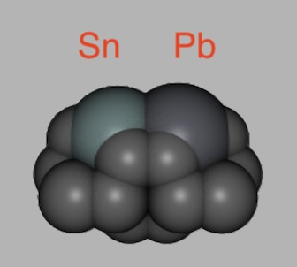
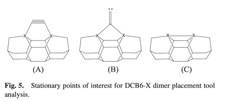

# Diamond Mechanosynthesis Tooltips

The following experiment uses three simulation techniques: real-space DFT, GFN2-xTB, GFN-FF. At the time of writing, the real-space DFT simulator only ran on CPU. It also didn't employ the DM21 exchange-correlation functional. Preceding [literature](https://github.com/philipturner/diamond-mechanosynthesis-literature-review) used plane-wave DFT and AM1.

This will be the first time the following workflow is attempted:
- Preconditioning: GFN-FF
- Minimization: GFN2-xTB
- Final singlepoint analysis: DFT


## Choice of DFT Library

Octopus is the fastest library for DFT, on both CPU and GPU. It was predicted that the easiest approach was learning Octopus, then porting it to the Apple GPU. After several hours of trying, I could not install or compile Octopus.

I gave up and went with GOSPEL. Being written in Python, it encounters none of the issues from outdated/failing Fortran compilers. I can use it directly from Swift via PythonKit, which is very nice. It may also be easier to modify. I can inject the DM21 functional with just a few lines of source code. I can also optimize GOSPEL by incrementally migrating portions of the Python code to Swift. The Octopus codebase can still be looked at. Even if it doesn't compile, one can reproduce the algorithms that make it so fast.

After compiling the PyLibXC bindings from scratch and injecting the arm64 dylib into the bindings folder, I got a successful execution. The energies differ from the expected values by an average of ~13%.

```swift
import Foundation
import PythonKit

PythonLibrary.useLibrary(at: "/Users/philipturner/miniforge3/bin/python")

let GOSPEL = Python.import("gospel.calculator").GOSPEL
let bulk = Python.import("ase.build").bulk
let Ha = Python.import("ase.units").Ha
print(GOSPEL)
print(bulk)
print(Ha)

let atoms = bulk("Si", "diamond", a: 5.43, cubic: true)
let calc = GOSPEL(
  grid: ["spacing":0.25],
  pp: ["upf":["/Users/philipturner/Documents/OpenMM/GOSPEL/tests/DATA/Si.pbe-n-nc.UPF"]],
  xc: ["type":"gga_x_pbe + gga_c_pbe"],
  convergence: ["density_tol":1e-5,
                "orbital_energy_tol":1e-5],
  occupation: [PythonObject("smearing"): PythonObject("Fermi-Dirac"),
               PythonObject("temperature"): PythonObject(0.01)])
atoms.calc = calc
let energy = atoms.get_potential_energy()
let fermi_level = calc.fermi_level
let band_gap = calc.band_gap

// The repository's Python script expects:
// energy = -31.1834133
// fermi_level = 4.63415316
// band_gap = 0.544

// Console output:
/*
 ============ Energy (Hartree) ==============
 |   Total Energy        : -38.3573241472   |
 --------------------------------------------
 | * Ion-ion Energy      : 0.0              |
 | * Eigenvals sum for 0 : -0.9187279427    |
 | * Hartree Energy      : 13.7191167575    |
 | * XC Energy           : -17.5471121454   |
 | * Kinetic Energy      : 13.0629049274    |
 | * External Energy     : -54.4786106028   |
 | * Non-local Energy    : 6.886376916      |
 ============================================
 Elapsed time[calc_and_print_energies]: 0.016855955123901367 sec
 Total Energy: -38.35732414724355 Ha
 Fermi Level : 4.245902105998337 eV
 Gap: 0.592 eV
 Transition (v -> c):
   (s=0, k=0, n=15, [0.00, 0.00, 0.00]) -> (s=0, k=0, n=16, [0.00, 0.00, 0.00])
 */
```

I will begin by reproducing the tooltips from Robert Freitas's first paper. Run them through xTB, then compare the structures and energies to the literature. Finally, get GOSPEL to accept the structures and output something about them.

## Tooltips

I had to make some modifications to `MolecularRendererApp`. The module was originally built to reproduce NanoEngineer + QuteMol as closely as possible. NanoEngineer only had a full parameter set for Z=1 to Z=36. To render Au(111) surfaces for early mechanosynthesis, Z=79 was added in ~June 2023. The DMS tooltips project required new rendering parameters for tin and lead.

<div align="center">



| Element    | Z   | Radius  | Color |
| :--------: | :-: | :-----: | :---: |
| Copper     |  29 | 2.325 Å | $\color{rgb(200, 128,  51)}{\texttt{200, 128,  51}}$ |
| Germanium  |  32 | 1.938 Å | $\color{rgb(102, 115,  26)}{\texttt{102, 115,  26}}$ |
| Tin (new)  |  50 | 2.227 Å | $\color{rgb(102, 128, 128)}{\texttt{102, 128, 128}}$ |
| Gold       |  79 | 2.623 Å | $\color{rgb(212, 175,  55)}{\texttt{212, 175,  55}}$ |
| Lead (new) |  82 | 2.339 Å | $\color{rgb( 87,  89,  97)}{\texttt{ 87,  89,  97}}$ |

</div>

Here are the compiled structures for each DCB6-Ge stationary point. The structures are compared to the schematic from the literature. Other tooltip variants will be rendered once they are all minimized.

<div align="center">




</div>
