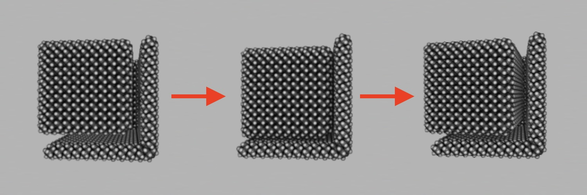

# Elastic Moduli

## Scene Setup

Experiment: a traditional energy minimizer does not minimize vdW potential energy to sufficient accuracy, only internal deformations. One typically starts a simulation with energy-minimized rigid bodies, then uses MD or RBD to simulate evolution over time.

Simulation: jig + specimen, 16,296 atoms, 9.6 ps evolution

Energy Minimization: 0.6 seconds latency

Molecular Dynamics: 2 fs timestep, 7.7 seconds latency

Rigid Body Dynamics: 40 fs timestep, 0.9 seconds latency

RBD seems sufficient for setting up the scene, and minimizing the vdW potential energy. One can erase the rigid body's velocity periodically to remove energy from the system. It is necessary to let the potential energy escape via kinetic energy. This differs from traditional energy minimization, which analyzes potential energy in isolation.
